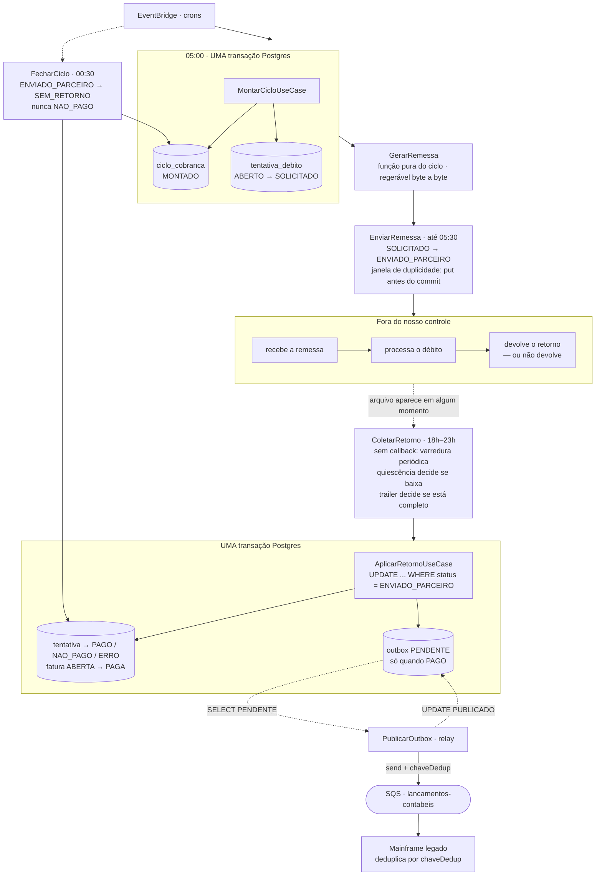

# mini-outbox-cobranca

Prova de **um** conceito: como garantir que um evento financeiro seja publicado
numa fila externa **exatamente uma vez em relação à decisão de negócio**, quando
a fila não participa da transação do banco.

Java 21 · Maven · Postgres · SQS (LocalStack) · sem Spring.

---

## O problema

Um sistema de débito automático de faturas de cartão. O cliente autoriza o
débito da fatura na conta que mantém num banco parceiro; todo dia, as faturas
que vencem naquela data são apresentadas ao banco para débito. O resultado de
cada tentativa volta e precisa refletir em dois lugares: na fatura do cliente,
que passa a PAGA, e no razão contábil, que recebe um **lançamento contábil** por
fatura paga. O razão é um mainframe legado que consome uma fila e aceita **um
lançamento por fatura**. Uma fatura pode ter N tentativas de débito; no máximo
uma delas paga, e no máximo um lançamento sai. Um lançamento duplicado não
quebra nada tecnicamente, mas gera uma divergência que alguém concilia à mão no
mês seguinte.

Bancos parceiros não atendem por chamada síncrona: trabalham por troca de
arquivos em janelas fixas. A remessa com as faturas do dia sai de madrugada, o
retorno chega em algum momento da noite — sem callback, sem aviso de que chegou,
às vezes particionado em mais de um arquivo, às vezes nunca. Não existe a quem
perguntar o que aconteceu com uma fatura específica antes da janela seguinte.
Isso força o desenho a ser um ciclo diário com fechamento explícito, e não um
fluxo reativo: em algum momento é preciso declarar o dia encerrado e dizer o que
aconteceu com as tentativas sobre as quais o parceiro não falou nada. É por isso
que existe `SEM_RETORNO` — o estado que registra a ausência de resposta sem
inventar uma.

O banco de dados e a fila são sistemas distintos, sem transação distribuída. Só
existem duas ordens possíveis, e as duas têm uma janela de falha. Se o `COMMIT`
vem antes do `send` e o processo morre no meio, a fatura fica PAGA e o lançamento
nunca é publicado — e, pior, **nada no sistema registra que havia algo a
publicar**, então nenhum reprocessamento descobre a perda. Se o `send` vem antes
do `COMMIT` e o processo morre no meio, o mainframe contabiliza um lançamento de
uma fatura que continua ABERTA: o mundo externo passa a conter um fato que o
sistema de registro nega. O mesmo raciocínio se aplica duas vezes no ciclo, e
não uma: na montagem, entre a escrita do ciclo no banco e o artefato de remessa
que sai para o parceiro; e na publicação, entre a escrita do resultado e a
mensagem na fila. Nos dois pontos há uma escrita que decide e um efeito externo
que não commita junto com ela.

A saída é não escolher entre as duas. A decisão de negócio e a **intenção de
publicar** são gravadas juntas, no mesmo `COMMIT` do Postgres — a intenção vira
uma linha na tabela `outbox`. Um **relay** separado lê o outbox e publica no SQS,
fora de qualquer transação. A janela some porque a mensagem só passa a existir
depois do commit que a autoriza. O que sobra de imperfeição fica explícito e
testado: se o relay morre entre o `send` e o `UPDATE outbox`, a mensagem é
republicada — at-least-once, com chave de dedup determinística para o consumidor
resolver.

## O ciclo de vida

A montagem do ciclo é a **única escrita que importa**. Remessa, retorno,
fechamento e publicação são trabalho derivado: dado o ciclo, todos podem ser
refeitos e chegam ao mesmo lugar. Por isso a remessa é uma função pura do ciclo
— mesma entrada, mesmos bytes — e por isso a reexecução da montagem é barrada
por um `UNIQUE (banco, data_ref)`, e não por uma consulta prévia que perderia a
corrida contra outro processo.



`EnviarRemessa` e `ColetarRetorno` aparecem no diagrama mas não têm classe neste
repositório — SFTP e CNAB estão fora de escopo, e isso é deliberado: o diagrama é
o desenho de sistema completo, o código é o recorte que carrega o aprendizado.

## Os três mecanismos

A correção deste desenho não vem de vigilância nem de retentativa. Vem de três
mecanismos, e de mais nenhum.

**Uma escrita transacional por passo.** Cada passo do ciclo tem exatamente uma
escrita que decide algo, num único banco, num único `COMMIT`. Nenhum sistema
externo participa dela.

**Trabalho derivado re-executável.** Tudo que vem depois da decisão é função do
estado commitado: a remessa é função pura do ciclo, a publicação é função do
outbox. Reexecutar é seguro por construção, e não por verificação prévia.

**Transição condicional de estado.** Toda aplicação de resultado externo é
`UPDATE ... WHERE status = <esperado>`. Zero linhas afetadas significa "já
processado" — e é isso que torna idempotente, de uma vez só, o arquivo reenviado,
o arquivo parcial, a linha duplicada e o reprocessamento manual.

Qualquer parte do desenho que não se apoie num destes três é um ponto de
fragilidade. Existe exatamente uma: a janela entre o `send` e o
`UPDATE PUBLICADO` do relay não se apoia em nenhum deles — e é por isso que ela
está documentada e testada, em vez de escondida.

Duas coisas o diagrama torna óbvias. A primeira: o subgraph do parceiro é o que
não controlamos — ele pode processar e não responder, e é por isso que existe
`SEM_RETORNO`. A segunda: entre o `send` e o `UPDATE PUBLICADO` (as linhas
tracejadas do relay) não há transação possível. É ali que mora o trade-off do
projeto inteiro.

## Como rodar

```bash
# testes — sobem Postgres e LocalStack sozinhos (Testcontainers), sem o Compose
mvn test

# ambiente local — schema e fila prontos, zero passo manual
docker compose -f infra/docker-compose.yml up
```

Só é preciso ter Docker rodando. `mvn test` **não** depende do Compose e o
Compose não depende dos testes; os dois aplicam os mesmos scripts de
`infra/init/`.

### Inspecionar a fila enquanto roda

```bash
alias awslocal='docker compose -f infra/docker-compose.yml exec localstack awslocal'

# a fila existe?
awslocal sqs list-queues

# quantas mensagens estão lá?
awslocal sqs get-queue-attributes \
  --queue-url http://localhost:4566/000000000000/lancamentos-contabeis \
  --attribute-names ApproximateNumberOfMessages

# ler sem consumir de vez (visibility 0 devolve a mensagem à fila)
awslocal sqs receive-message \
  --queue-url http://localhost:4566/000000000000/lancamentos-contabeis \
  --max-number-of-messages 10 --visibility-timeout 0 \
  --message-attribute-names All
```

E o outbox, do outro lado:

```bash
docker compose -f infra/docker-compose.yml exec postgres \
  psql -U cobranca -d cobranca -c "SELECT id, fatura_id, status FROM outbox ORDER BY id"
```

## As decisões, com o preço

| Decisão | Alternativa descartada | O que se paga |
|---|---|---|
| Outbox na mesma transação, publicação fora ([ADR-0001](docs/adr/0001-outbox-transacional-em-vez-de-dual-write.md)) | publicar e depois commitar | latência do relay, uma tabela a mais, escrita dobrada na transação de negócio |
| At-least-once + chave de dedup ([ADR-0002](docs/adr/0002-at-least-once-mais-dedup-em-vez-de-fifo.md)) | SQS FIFO com `MessageDeduplicationId` | duplicata possível na fila; o consumidor precisa cooperar |
| `UPDATE ... WHERE status = 'ENVIADO_PARCEIRO'` | tabela de deduplicação de retornos | a idempotência fica implícita no número de linhas afetadas, e não num registro explícito |
| `UNIQUE (banco, data_ref)` no ciclo | consultar antes se o ciclo já existe | a segunda montagem falha com erro de constraint em vez de ser ignorada em silêncio — mas verificação prévia é uma corrida, e constraint é um fato |
| Ausência de retorno vira `SEM_RETORNO` | colapsar em `NAO_PAGO` | mais um estado para tratar — em troca de não notificar o cliente sobre uma falha de débito que ninguém afirmou que ocorreu |
| Só `PAGO` gera lançamento, e a regra mora no enum | um `if` dentro do use case | um estado novo quebra a compilação do lugar certo, em vez de passar despercebido |
| `UNIQUE (fatura_id)` no outbox | só a guarda no código | o segundo lançamento estoura em vez de ser ignorado silenciosamente |
| JDBC puro, sem framework | Spring Boot + `@Transactional` | mais código de encanamento — em troca, a fronteira transacional fica visível no código, que é justamente o que o projeto quer mostrar |

**A fronteira de responsabilidade**, dita em voz alta:

| Garantia | De quem |
|---|---|
| No máximo um lançamento **decidido** por fatura | deste projeto |
| Todo lançamento decidido é **eventualmente** publicado | deste projeto |
| No máximo um lançamento **efetivado** no mainframe | do consumidor, via `chaveDedup` |

Exatamente-uma-vez ponta a ponta não é entregável por este lado: o produtor não
sabe se um `send` que não retornou chegou, e só pode escolher entre reenviar
(duplicata) e não reenviar (perda). Nenhuma configuração de fila cria uma
terceira opção.

## O que foi deliberadamente simplificado

Isto é uma prova de conceito, não um serviço de produção. Ficou de fora, de
propósito:

- **Sem particionamento do outbox** — um único `SELECT ... WHERE status =
  'PENDENTE'`. Em produção, com dois relays, seria `FOR UPDATE SKIP LOCKED` e
  partição por hash da fatura.
- **Sem backoff nem retry** — o relay tenta uma vez por passada. Uma falha de
  rede vira "tenta de novo na próxima", sem espera exponencial.
- **Sem DLQ** — uma mensagem que falha sempre falha para sempre e trava a fila do
  relay. Em produção, N tentativas e desvio para uma fila morta.
- **Um único publicador** — não há eleição de líder nem lock. Dois processos
  rodando o relay publicariam em duplicidade (o que, note, o desenho tolera:
  mesma chave de dedup).
- **Dedup delegada ao consumidor** — este projeto não simula o mainframe. Ele
  garante a chave estável; quem desduplica é o outro lado.
- **Sem expurgo do outbox** — nada apaga linhas `PUBLICADO`. Em produção, é a
  tabela que mais cresce.
- **Sem pool de conexões, sem métricas, sem tracing.**

E, do lado do desenho de sistema, ficou de fora tudo que é canal e formato — não
porque seja fácil, mas porque não muda nenhuma das decisões que o projeto
defende:

- **SFTP e parsing de CNAB 240**, incluindo validação de trailer e detecção de
  quiescência do arquivo. É I/O e formato: o resultado do parse alimenta
  exatamente o mesmo `AplicarRetornoUseCase`. Aqui a remessa é uma String
  determinística de 3 campos posicionais, que é a única propriedade do formato
  que o projeto usa como argumento.
- **Canal síncrono com throttle** (o banco que expõe API REST em vez de arquivo)
  e o **rate limiter distribuído** que ele exigiria. Trocaria o ciclo em lote por
  uma tentativa por requisição — muda o transporte e a política de vazão, não a
  fronteira transacional.
- **Conciliação D+1 contra o extrato agregado de liquidação.** É o controle que
  pega o que este desenho deixa passar (o lançamento duplicado que o consumidor
  não deduplicou). Pertence à camada de controle contábil, não ao produtor.
- **Ciclo de vida da autorização de débito e sua revogação** pelos dois caminhos
  — o cliente revogando no app e o parceiro informando `AUTORIZACAO_REVOGADA` no
  retorno. Aqui a revogação aparece só como motivo de `NAO_PAGO`; o agregado de
  autorização e a corrida entre os dois caminhos são um projeto à parte.
- **Política de retentativa** e a classificação **transitório × permanente** dos
  códigos de retorno. `SALDO_INSUFICIENTE` pede reapresentação;
  `CONTA_ENCERRADA` não pede nenhuma. Este projeto registra o motivo e para por
  aí — decidir o que fazer com ele é regra de negócio, e regra de negócio é o
  que se corta primeiro.

## Estrutura

```
docs/brief.md            o contexto e o problema
docs/adr/                as duas decisões que sustentam o projeto
docs/steps/              o que cada step entrega e sua Definition of Done
infra/                   docker-compose + scripts de init (schema e fila)
src/main/java/...
  domain/model           Fatura, CicloCobranca, TentativaDebito, Remessa,
                         LancamentoContabil, RegistroOutbox
  domain/port            RepositorioFatura, RepositorioCiclo, RepositorioTentativa,
                         RepositorioOutbox, PublicadorLancamento
  domain/usecase         MontarCiclo, GerarRemessa, AplicarRetorno,
                         FecharCiclo, PublicarOutbox
  infra/persistence      JDBC puro, uma implementação por porta
```

Máquina de estados:

```
CicloCobranca    MONTADO → ENVIADO → FECHADO
TentativaDebito  ABERTO → SOLICITADO → ENVIADO_PARCEIRO → PAGO | NAO_PAGO | ERRO
                                                        → SEM_RETORNO (fechamento)
Fatura           ABERTA → PAGA → LANCADA
```

`api → domain ← infra`. O domínio não importa framework nem AWS SDK — e há um
teste que falha se isso mudar (`FundacaoTest.dominioIsolado`).

## Estado

Ver [PLAN.md](PLAN.md). Um step por sessão.
