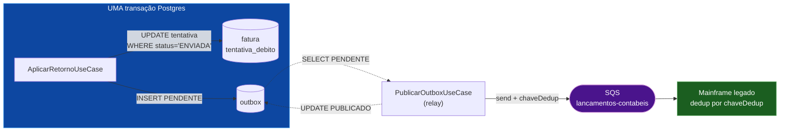

# mini-outbox-cobranca

Prova de **um** conceito: como garantir que um evento financeiro seja publicado
numa fila externa **exatamente uma vez em relação à decisão de negócio**, quando
a fila não participa da transação do banco.

Java 21 · Maven · Postgres · SQS (LocalStack) · sem Spring.

---

## O problema

Um sistema de débito automático processa arquivos de retorno de um banco
parceiro. Cada linha diz o que aconteceu com uma tentativa de débito. Quando uma
fatura é marcada como **PAGA**, um **lançamento contábil** precisa ser publicado
numa fila que um mainframe legado consome. O mainframe aceita **um lançamento
por fatura** — um lançamento duplicado não quebra nada tecnicamente, mas gera uma
divergência que alguém concilia à mão no mês seguinte. Uma fatura pode ter N
tentativas de débito; no máximo uma delas paga, e no máximo um lançamento sai.

O banco de dados e a fila são sistemas distintos, sem transação distribuída. Só
existem duas ordens possíveis, e as duas têm uma janela de falha. Se o `COMMIT`
vem antes do `send` e o processo morre no meio, a fatura fica PAGA e o lançamento
nunca é publicado — e, pior, **nada no sistema registra que havia algo a
publicar**, então nenhum reprocessamento descobre a perda. Se o `send` vem antes
do `COMMIT` e o processo morre no meio, o mainframe contabiliza um lançamento de
uma fatura que continua ABERTA: o mundo externo passa a conter um fato que o
sistema de registro nega.

A saída é não escolher entre as duas. A decisão de negócio e a **intenção de
publicar** são gravadas juntas, no mesmo `COMMIT` do Postgres — a intenção vira
uma linha na tabela `outbox`. Um **relay** separado lê o outbox e publica no SQS,
fora de qualquer transação. A janela some porque a mensagem só passa a existir
depois do commit que a autoriza. O que sobra de imperfeição fica explícito e
testado: se o relay morre entre o `send` e o `UPDATE outbox`, a mensagem é
republicada — at-least-once, com chave de dedup determinística para o consumidor
resolver.

## O fluxo



A linha tracejada entre o relay e o outbox é onde mora o trade-off: entre o
`send` e o `UPDATE PUBLICADO` não há transação possível.

## Como rodar

```bash
# testes — sobem Postgres e LocalStack sozinhos (Testcontainers), sem o Compose
mvn test

# ambiente local — schema e fila prontos, zero passo manual
docker compose -f infra/docker-compose.yml up
```

Só é preciso ter Docker rodando. `mvn test` **não** depende do Compose e o
Compose não depende dos testes; os dois aplicam os mesmos scripts de
`infra/init/`.

### Inspecionar a fila enquanto roda

```bash
alias awslocal='docker compose -f infra/docker-compose.yml exec localstack awslocal'

# a fila existe?
awslocal sqs list-queues

# quantas mensagens estão lá?
awslocal sqs get-queue-attributes \
  --queue-url http://localhost:4566/000000000000/lancamentos-contabeis \
  --attribute-names ApproximateNumberOfMessages

# ler sem consumir de vez (visibility 0 devolve a mensagem à fila)
awslocal sqs receive-message \
  --queue-url http://localhost:4566/000000000000/lancamentos-contabeis \
  --max-number-of-messages 10 --visibility-timeout 0 \
  --message-attribute-names All
```

E o outbox, do outro lado:

```bash
docker compose -f infra/docker-compose.yml exec postgres \
  psql -U cobranca -d cobranca -c "SELECT id, fatura_id, status FROM outbox ORDER BY id"
```

## As decisões, com o preço

| Decisão | Alternativa descartada | O que se paga |
|---|---|---|
| Outbox na mesma transação, publicação fora ([ADR-0001](docs/adr/0001-outbox-transacional-em-vez-de-dual-write.md)) | publicar e depois commitar | latência do relay, uma tabela a mais, escrita dobrada na transação de negócio |
| At-least-once + chave de dedup ([ADR-0002](docs/adr/0002-at-least-once-mais-dedup-em-vez-de-fifo.md)) | SQS FIFO com `MessageDeduplicationId` | duplicata possível na fila; o consumidor precisa cooperar |
| `UPDATE ... WHERE status = 'ENVIADA'` | tabela de deduplicação de retornos | a idempotência fica implícita no número de linhas afetadas, e não num registro explícito |
| `UNIQUE (fatura_id)` no outbox | só a guarda no código | o segundo lançamento estoura em vez de ser ignorado silenciosamente |
| JDBC puro, sem framework | Spring Boot + `@Transactional` | mais código de encanamento — em troca, a fronteira transacional fica visível no código, que é justamente o que o projeto quer mostrar |

**A fronteira de responsabilidade**, dita em voz alta:

| Garantia | De quem |
|---|---|
| No máximo um lançamento **decidido** por fatura | deste projeto |
| Todo lançamento decidido é **eventualmente** publicado | deste projeto |
| No máximo um lançamento **efetivado** no mainframe | do consumidor, via `chaveDedup` |

Exatamente-uma-vez ponta a ponta não é entregável por este lado: o produtor não
sabe se um `send` que não retornou chegou, e só pode escolher entre reenviar
(duplicata) e não reenviar (perda). Nenhuma configuração de fila cria uma
terceira opção.

## O que foi deliberadamente simplificado

Isto é uma prova de conceito, não um serviço de produção. Ficou de fora, de
propósito:

- **Sem particionamento do outbox** — um único `SELECT ... WHERE status =
  'PENDENTE'`. Em produção, com dois relays, seria `FOR UPDATE SKIP LOCKED` e
  partição por hash da fatura.
- **Sem backoff nem retry** — o relay tenta uma vez por passada. Uma falha de
  rede vira "tenta de novo na próxima", sem espera exponencial.
- **Sem DLQ** — uma mensagem que falha sempre falha para sempre e trava a fila do
  relay. Em produção, N tentativas e desvio para uma fila morta.
- **Um único publicador** — não há eleição de líder nem lock. Dois processos
  rodando o relay publicariam em duplicidade (o que, note, o desenho tolera:
  mesma chave de dedup).
- **Dedup delegada ao consumidor** — este projeto não simula o mainframe. Ele
  garante a chave estável; quem desduplica é o outro lado.
- **Sem expurgo do outbox** — nada apaga linhas `PUBLICADO`. Em produção, é a
  tabela que mais cresce.
- **Sem pool de conexões, sem métricas, sem tracing.**

## Estrutura

```
docs/brief.md            o contexto e o problema
docs/adr/                as duas decisões que sustentam o projeto
docs/steps/              o que cada step entrega e sua Definition of Done
infra/                   docker-compose + scripts de init (schema e fila)
src/main/java/...
  domain/model           Fatura, TentativaDebito, LancamentoContabil, RegistroOutbox
  domain/port            RepositorioFatura, RepositorioOutbox, PublicadorLancamento
  domain/usecase         AplicarRetornoUseCase, PublicarOutboxUseCase
  infra/persistence      JDBC puro
```

`api → domain ← infra`. O domínio não importa framework nem AWS SDK — e há um
teste que falha se isso mudar (`FundacaoTest.dominioIsolado`).

## Estado

Ver [PLAN.md](PLAN.md). Um step por sessão.
