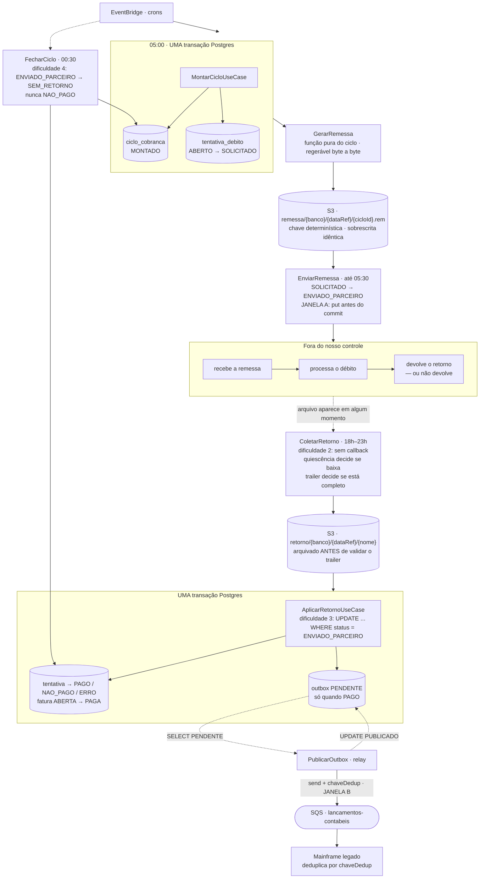
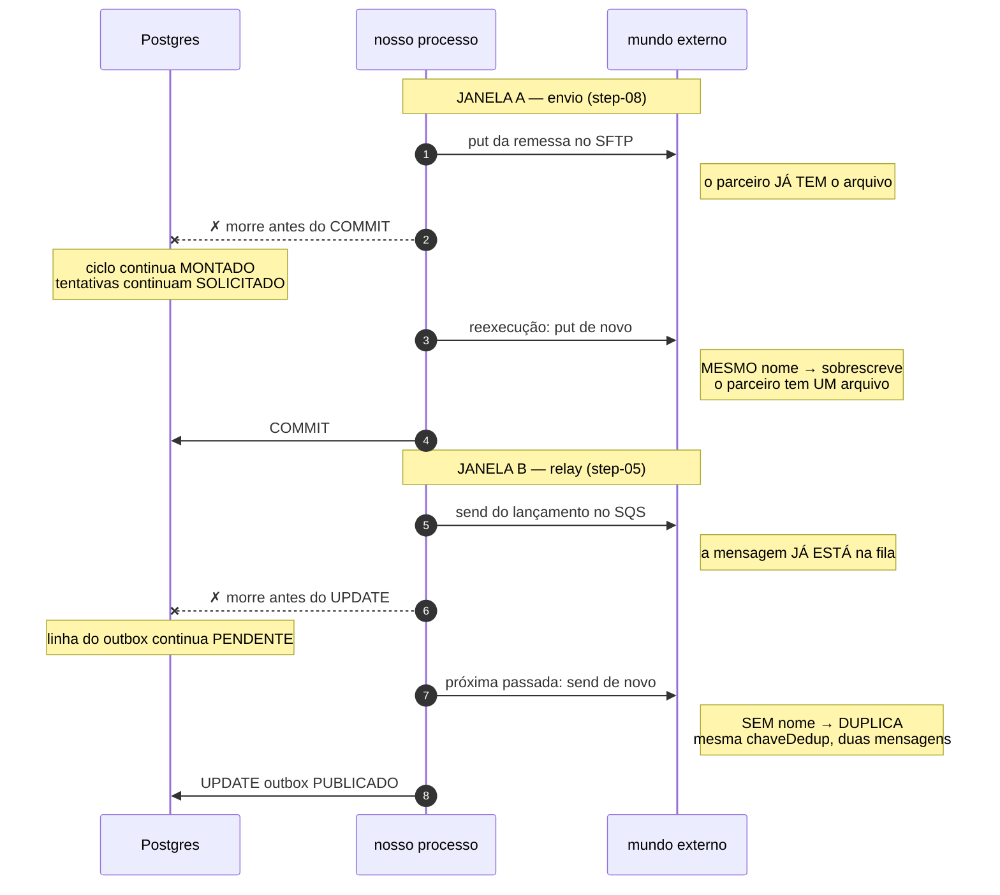
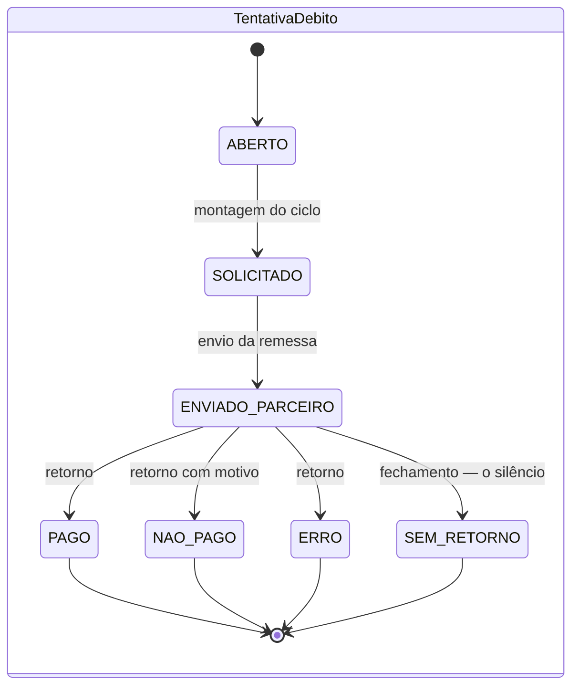

# mini-outbox-cobranca

Um problema de system design, escrito por inteiro, e resolvido em código que
roda. O código não é a ilustração do documento — é a prova dele: **cada
mecanismo defendido aqui tem um teste que falha se ele parar de funcionar**, e
os nomes desses testes estão citados ao lado de cada afirmação.

Java 21 · Maven · Postgres · SQS e S3 (LocalStack) · SFTP (`atmoz/sftp`) ·
Spring Boot (Web).

### Como ler

| se você quer… | vá para |
|---|---|
| entender o problema | [A pergunta](#a-pergunta-que-o-projeto-responde) → [As quatro dificuldades](#as-quatro-dificuldades) |
| ver a solução desenhada | [A solução, em um desenho](#a-solução-em-um-desenho) |
| **acompanhar o raciocínio passo a passo** | [Teste de mesa](#teste-de-mesa) — o ciclo percorrido à mão |
| saber o que custou cada escolha | [As decisões, com o preço](#as-decisões-com-o-preço) |
| rodar e mexer | [Ver acontecendo](#ver-acontecendo) |

---

## A pergunta que o projeto responde

> **Como fechar um ciclo diário de cobrança contra um parceiro que só fala por
> arquivo, não avisa quando responde, às vezes responde pela metade, às vezes
> reenvia o mesmo arquivo, e às vezes não responde — garantindo que cada fatura
> paga gere exatamente um lançamento no razão contábil?**

Tudo o que vem abaixo existe para responder essa frase. Se um mecanismo,
um teste ou uma tabela deste repositório não puder ser ligado de volta a ela,
está sobrando.

## O contexto

Um sistema de débito automático de faturas de cartão. O cliente autoriza o
débito da fatura na conta que mantém num banco parceiro; todo dia, as faturas
que vencem naquela data são apresentadas ao banco para débito. O resultado de
cada tentativa precisa refletir em dois lugares: na **fatura** do cliente, que
passa a PAGA, e no **razão contábil**, que recebe um lançamento por fatura paga.

O razão é um mainframe legado que consome uma fila e aceita **um lançamento por
fatura**. Uma fatura pode ter N tentativas de débito — o banco reapresenta —,
no máximo uma delas paga, e no máximo um lançamento sai. Um lançamento
duplicado não quebra nada tecnicamente; gera uma divergência que alguém
concilia à mão no mês seguinte, lendo dois sistemas.

Bancos parceiros não atendem por chamada síncrona: trabalham por troca de
arquivos em janelas fixas. A remessa com as faturas do dia sai de madrugada, o
retorno chega em algum momento da noite — sem callback, sem aviso de que
chegou, às vezes particionado em mais de um arquivo, às vezes nunca. Não existe
a quem perguntar o que aconteceu com uma fatura específica antes da janela
seguinte.

Isso força o desenho a ser um **ciclo diário com fechamento explícito**, e não
um fluxo reativo: em algum momento é preciso declarar o dia encerrado e dizer o
que aconteceu com as tentativas sobre as quais o parceiro não falou nada.

### As restrições, ditas em voz alta

| | |
|---|---|
| **Não há transação distribuída** | Postgres, S3, SFTP e SQS são quatro sistemas. Nenhum commita junto com outro. |
| **O parceiro não é chamável** | não há API, não há callback, não há como perguntar o estado de uma fatura. |
| **O consumidor é legado** | o mainframe não muda por nós. Ele aceita um lançamento por fatura e deduplica pelo que lhe dermos. |
| **O ciclo é diário e em lote** | um banco, uma data, um arquivo. Não há tentativa avulsa. |

## As quatro dificuldades

O problema não é um. São quatro, e cada uma tem uma resposta diferente. A
tentação é tratar todas como "erro de integração" e resolver com retentativa —
e retentativa é resposta errada para três delas.

### 1 · Duas escritas, dois sistemas, nenhuma transação — e isso acontece duas vezes

Não é um ponto do fluxo, são dois. Na **montagem**: gravar a decisão no Postgres
e produzir o artefato de remessa que sai para o parceiro. Na **publicação**:
marcar o lançamento no banco e enviá-lo à fila do mainframe.

Nos dois casos existem apenas duas ordens possíveis, e as duas têm uma janela
de morte:

| ordem | se o processo morre no meio | o que sobra |
|---|---|---|
| `COMMIT` → efeito externo | depois do commit | a decisão existe, o efeito nunca aconteceu — e **nada registra que havia algo a fazer**, então nenhum reprocessamento descobre a perda |
| efeito externo → `COMMIT` | depois do efeito | o mundo externo contém um fato que o sistema de registro **nega** |

O segundo é o pior: o mainframe contabiliza uma fatura que continua ABERTA, e
não há de onde saber que isso aconteceu.

**A resposta é a mesma dos dois lados: uma escrita transacional que decide, e
todo o resto vira trabalho derivado do que foi commitado.** A remessa é função
pura do ciclo; a publicação é função do outbox. Nada externo entra na transação,
e nada externo precisa entrar — porque tudo que é externo pode ser refeito a
partir do que ficou commitado.

Para a publicação isso tem nome: a decisão de negócio e a **intenção de
publicar** vão no mesmo `COMMIT`, e a intenção vira uma linha na tabela
`outbox`. Um relay separado lê o outbox e publica na fila, fora de qualquer
transação. A janela some porque a mensagem só passa a existir depois do commit
que a autoriza — ver [ADR-0001](docs/adr/0001-outbox-transacional-em-vez-de-dual-write.md).

### 2 · Não existe callback

O retorno aparece num diretório SFTP em algum momento da noite. Ninguém avisa.
Isso força varredura periódica — e força duas decisões que nada mais no sistema
exige:

- **Quiescência.** O arquivo parou de crescer? Tamanho e `mtime` iguais em duas
  leituras separadas por um intervalo. Sem isso, você baixa metade de um arquivo
  que o parceiro ainda está escrevendo.
- **Trailer.** A contagem declarada no rodapé bate com as linhas lidas? Sem
  isso, você processa um arquivo truncado como se fosse legítimo.

As duas juntas respondem uma pergunta só, e é uma pergunta que só existe porque
não há callback: *este arquivo está pronto para ser acreditado?* Um arquivo que
não passa nas duas é **descartado inteiro** e reavaliado na passada seguinte.
Aplicar as linhas que deram para ler seria produzir um retorno parcial
indistinguível de um retorno legítimo menor — e o fechamento do ciclo
transformaria o resto em `SEM_RETORNO`, afirmando silêncio onde havia ruído.

### 3 · O mesmo retorno pode chegar mais de uma vez, de várias formas

Arquivo reenviado idêntico. Arquivo particionado com sobreposição. Linha
duplicada dentro do arquivo. Reprocessamento manual do operador porque alguém
achou que tinha dado errado.

São quatro problemas diferentes com uma solução só:

```sql
UPDATE tentativa_debito SET status = ? WHERE id = ? AND status = 'ENVIADO_PARCEIRO'
```

**Zero linhas afetadas significa "já processado".** Não é erro, é o caso normal
de um arquivo reprocessado. A idempotência não vem de tabela de deduplicação
nem de hash — vem de a transição de estado ser **condicional**. É a mesma
guarda que absorve os quatro casos, sem que nenhum deles precise ser detectado
antes.

Existe um `sha256` de arquivo de retorno neste projeto, e ele **não** é o
mecanismo: é um atalho de custo, que evita reparsear bytes idênticos aos de um
arquivo já aplicado. Um reenvio reagrupado em outro número de arquivos tem hash
diferente e passa direto por ele — e aí quem decide é o `UPDATE` condicional,
afetando zero linhas. Se o atalho fosse removido, nada quebraria; ficaria mais
lento.

### 4 · O silêncio não é uma resposta

Se o ciclo fecha e nada chegou para uma tentativa, o sistema **não pode** marcar
`NAO_PAGO`. Isso dispararia um push dizendo ao cliente que o débito falhou, com
base num fato que ninguém afirmou. Vira `SEM_RETORNO`, que é exceção
operacional — alguém olha, ninguém é notificado, e nenhum lançamento sai.

É a decisão mais barata de implementar do projeto inteiro — um estado a mais num
enum — e a que mais separa quem pensou no problema de quem só o codificou.
Colapsar `SEM_RETORNO` em `NAO_PAGO` economiza um `case` e inventa um fato.

## A solução, em um desenho

A montagem do ciclo é a **única escrita que importa**. Remessa, retorno,
fechamento e publicação são trabalho derivado: dado o ciclo, todos podem ser
refeitos e chegam ao mesmo lugar. Por isso a remessa é função pura do ciclo —
mesma entrada, mesmos bytes — e por isso a reexecução da montagem é barrada por
um `UNIQUE (banco, data_ref)`, e não por uma consulta prévia que perderia a
corrida contra outro processo.



Os horários são o desenho de produção, onde quem dispara cada passo é o
EventBridge. Neste repositório não há cron nem `@Scheduled`: **cada passo é um
endpoint e um botão**, e cada clique é uma execução do job.

### As duas janelas, de perto

As setas tracejadas do diagrama são o coração do problema. São os dois pontos
em que um efeito externo acontece **antes** do `COMMIT` que o registra, e onde
nenhuma transação é possível:



**A diferença entre as duas é o preço de reexecutar, e ela é toda sobre nomes.**
O arquivo no parceiro e o objeto no S3 têm nome determinístico: a segunda
gravação sobrescreve com os mesmos bytes, e o mundo externo não percebe que
houve duas. A mensagem no SQS não tem nome: a segunda duplica. É por isso que
só a fila obriga o consumidor a cooperar —
ver [ADR-0002](docs/adr/0002-at-least-once-mais-dedup-em-vez-de-fifo.md)
e [ADR-0003](docs/adr/0003-artefato-duravel-no-s3-em-vez-de-geracao-em-memoria.md).

Note o que a Janela B **não** é: não é um bug a ser consertado. Fechá-la
exigiria marcar `PUBLICADO` antes de enviar — o que troca uma duplicata visível
por uma mensagem perdida que ninguém procura. Não existe terceira opção; existe
escolher qual dos dois erros se prefere. Este projeto prefere o visível.

## Dois tipos de garantia

É tentador listar "os mecanismos" numa lista só. Eles não são da mesma
natureza, e misturá-los esconde o desenho.

**Garantias de correção sob falha** — o processo morre e o sistema converge:

1. **Uma escrita transacional por passo.** Cada passo tem exatamente uma escrita
   que decide algo, num único banco, num único `COMMIT`. Nenhum sistema externo
   participa dela.
2. **Trabalho derivado re-executável.** Tudo depois da decisão é função do
   estado commitado. Reexecutar é seguro por construção, não por verificação
   prévia.
3. **Transição condicional de estado.** Toda aplicação de resultado externo é
   `UPDATE ... WHERE status = <esperado>`. Zero linhas significa "já
   processado".

Essas três resolvem as dificuldades **1** e **3**, e valem para qualquer
integração assíncrona — não têm nada de específico a cobrança.

**Garantias de honestidade** — o sistema não afirma o que ninguém disse:

4. **Quiescência e trailer.** Um arquivo só é acreditado quando parou de
   crescer e o rodapé fecha. O que não passa é descartado inteiro.
5. **`SEM_RETORNO`.** Ausência de resposta é registrada como ausência, e nunca
   colapsada num desfecho.

Essas duas resolvem as dificuldades **2** e **4**, e existem porque o canal é um
diretório e o parceiro é mudo. São a parte do desenho que some quando alguém
descreve o problema como "integração por arquivo" e para por aí.

Qualquer parte do sistema que não se apoie numa das cinco é um ponto de
fragilidade. Existem exatamente duas, são as janelas A e B, e estão documentadas
e testadas em vez de escondidas.

## Teste de mesa

Um ciclo, quatro faturas, percorrido à mão — com o estado das tabelas depois de
cada passo, e "e se morrer aqui?" nos dois pontos em que isso importa.

É o cenário que `mvn compile exec:java` roda e `CenarioPontaAPontaTest` verifica,
com **um passo a mais**: o arquivo de retorno truncado, no passo 4. O cenário do
console não o inclui, e sem ele a dificuldade 2 não apareceria aqui. Esse passo
é provado por `ArquivoIncompletoNaoEhProcessadoTest` e por
`ArquivoEmEscritaNaoEhBaixadoTest`.

Cada fatura carrega uma coisa diferente:

| fatura | história | o que ela prova |
|---|---|---|
| `F-1` | paga, e o retorno chega **duas vezes** | dificuldade 3 — o `UPDATE` que afeta zero linhas |
| `F-2` | recusada por saldo, **reapresentada** e paga | invariante 1 — duas tentativas, **um** lançamento |
| `F-3` | paga, e o **relay morre** depois do `send` | dificuldade 1, janela B — at-least-once |
| `F-4` | o parceiro **nunca fala** dela | dificuldade 4 — `SEM_RETORNO` |

Banco `341`, data de referência `2026-08-31`, ciclo `C-1`. Os números daqui — os
282 bytes, o `sha256`, as contagens — são os da execução real, não ilustrações.

---

### Estado inicial

```
fatura            F-1 ABERTA   F-2 ABERTA   F-3 ABERTA   F-4 ABERTA
tentativa_debito  T-1 ABERTO (F-1)   T-2 ABERTO (F-2)   T-3 ABERTO (F-2)
                  T-4 ABERTO (F-3)   T-5 ABERTO (F-4)
ciclo_cobranca    —
outbox            —
S3                —
SFTP /remessa     —      SFTP /retorno   —
SQS               —
```

`F-2` já nasce com duas tentativas: é uma fatura que o banco vai recusar e
reapresentar. Cinco tentativas para quatro faturas.

---

### Passo 1 · Montar o ciclo — **uma transação**

```sql
BEGIN;
  INSERT INTO ciclo_cobranca (id, banco, data_ref, status)
       VALUES ('C-1', '341', '2026-08-31', 'MONTADO');
  UPDATE tentativa_debito SET ciclo_id = 'C-1', status = 'SOLICITADO'
   WHERE status = 'ABERTO' AND banco = '341' AND data_ref = '2026-08-31';
COMMIT;
```

```
ciclo_cobranca    C-1 MONTADO (341, 2026-08-31)
tentativa_debito  T-1..T-5  SOLICITADO
```

**O que fica provado.** Esta é a única escrita que importa. Tudo daqui para a
frente é dedutível dela.

**E se rodar de novo?** O `INSERT` bate no `UNIQUE (banco, data_ref)` e a
transação inteira aborta — nada de meio-montado. A alternativa seria
`SELECT ... IF NOT EXISTS`, que perde a corrida contra outro processo entre o
`SELECT` e o `INSERT`. Verificação prévia é uma opinião; constraint é um fato.

---

### Passo 2 · Gerar a remessa — função pura

O ciclo é projetado num artefato posicional de largura fixa e gravado no S3.
Estes são os 282 bytes exatos que saem — tipo(1) + campos de largura fixa,
`\n` fixo, valor em centavos inteiros:

```
034120260831C-1
1T-1             F-1             000000000010000
1T-2             F-2             000000000025050
1T-3             F-2             000000000025050
1T-4             F-3             000000000008990
1T-5             F-4             000000000004200
9000005
```

```
header   0 | banco(3) | data(8) | ciclo(16)
detalhe  1 | id_tentativa(16) | id_fatura(16) | centavos(15)
trailer  9 | contagem(6)
```

Nada aqui depende do relógio, do locale ou do sistema operacional: o `\n` é
fixo em vez de `System.lineSeparator()`, e o valor é inteiro em centavos em vez
de decimal com vírgula. São as duas coisas que fariam o mesmo ciclo gerar bytes
diferentes em máquinas diferentes.

```
ciclo_cobranca  C-1 MONTADO  remessa_chave=remessa/341/20260831/C-1.rem
                             remessa_sha256=588b15cc…
S3              remessa/341/20260831/C-1.rem   282 bytes
```

**O que fica provado.** Mesma entrada, mesmos bytes. Gerar duas vezes produz o
mesmo `sha256` e sobrescreve o mesmo objeto — a chave vem do ciclo, não do
relógio nem de um UUID. É o que torna "trabalho derivado re-executável" uma
propriedade e não uma esperança (`RemessaDeterministicaTest`).

O `id_tentativa` está em **posição fixa** de propósito: é a correlation key que
o retorno vai devolver. Sem ela, casar retorno com tentativa viraria heurística.

---

### Passo 3 · Enviar — **a janela A se abre aqui**

```
put  s3://…/C-1.rem  →  sftp:/remessa/341-20260831-C-1.rem
BEGIN;
  UPDATE tentativa_debito SET status = 'ENVIADO_PARCEIRO'
   WHERE ciclo_id = 'C-1' AND status = 'SOLICITADO';
  UPDATE ciclo_cobranca SET status = 'ENVIADO'
   WHERE id = 'C-1' AND status = 'MONTADO';
COMMIT;
```

As duas guardas de status não são zelo: são elas que absorvem a retransmissão
que a janela abaixo produz. A tentativa que já saiu não sai de novo, e o ciclo
já `ENVIADO` não volta atrás.

```
ciclo_cobranca    C-1 ENVIADO
tentativa_debito  T-1..T-5  ENVIADO_PARCEIRO
SFTP /remessa     341-20260831-C-1.rem
```

> **Morrendo entre o `put` e o `COMMIT`:**
> o parceiro tem o arquivo, e para o banco nada aconteceu — `C-1` continua
> `MONTADO`, `T-1..T-5` continuam `SOLICITADO`. A reexecução transmite de novo,
> e o **nome determinístico** faz a segunda entrega sobrescrever a primeira.
> O parceiro fica com **um** arquivo, não dois.
> Custo real: se ele já tinha lido o primeiro, processa duas vezes — e quem
> absorve isso é o passo 5. (`CrashDepoisDoPutTest`)

---

### Passo 4 · O parceiro responde — mal, primeiro

O parceiro começa a escrever o retorno. A varredura roda no meio da escrita:

```
leitura 1 de /retorno/341-20260831-C-1.ret   tamanho=140  mtime=23:04:12
… intervalo …
leitura 2                                    tamanho=205  mtime=23:04:13
```

Tamanhos diferentes → **não quiesceu** → o arquivo nem é baixado.
`ArquivoEmEscritaNaoEhBaixadoTest`.

Na passada seguinte o arquivo parou de crescer, é baixado, **arquivado no S3
antes de qualquer validação** — o arquivo que não fecha é justamente o que
alguém vai querer olhar — e só então o trailer é conferido:

```
trailer declara  5     linhas de detalhe lidas  4     → INCOMPLETO
```

**O arquivo é descartado inteiro.** Nenhuma das 4 linhas é aplicada.
`ArquivoIncompletoNaoEhProcessadoTest`.

```
S3    retorno/341/20260831/341-20260831-C-1.ret   (arquivado mesmo assim)
tentativa_debito  T-1..T-5  ENVIADO_PARCEIRO  ← nada mudou
```

**O que fica provado.** Aplicar as 4 linhas que deram para ler produziria um
estado indistinguível de um retorno legítimo de 4 linhas — e no passo 6 a quinta
tentativa viraria `SEM_RETORNO`, afirmando silêncio onde havia um arquivo
truncado. Descartar custa uma passada; aplicar custa uma mentira.

---

### Passo 5 · O retorno bom chega — **e chega duas vezes**

O parceiro reescreve, agora completo. A coleta baixa, o trailer fecha, e cada
linha vai ao aplicador. Uma transação por linha:

```sql
BEGIN;
  UPDATE tentativa_debito SET status = 'PAGO', motivo = NULL
   WHERE id = 'T-1' AND status = 'ENVIADO_PARCEIRO';     -- 1 linha afetada
  UPDATE fatura SET status = 'PAGA' WHERE id = 'F-1';
  INSERT INTO outbox (fatura_id, payload, status)
       VALUES ('F-1', '{"faturaId":"F-1","valor":"100.00"}', 'PENDENTE');
COMMIT;
```

Linha a linha, o que acontece:

| linha | tentativa | `UPDATE` afeta | fatura | outbox |
|---|---|---|---|---|
| `T-1 PAGO` | `ENVIADO_PARCEIRO` → `PAGO` | **1** | `F-1` → PAGA | `+ F-1 PENDENTE` |
| `T-1 PAGO` *(duplicada)* | já está `PAGO` | **0** | — | — |
| `T-2 NAO_PAGO` (saldo) | → `NAO_PAGO` | **1** | — | — |
| `T-3 PAGO` (reapresentação) | → `PAGO` | **1** | `F-2` → PAGA | `+ F-2 PENDENTE` |
| `T-4 PAGO` | → `PAGO` | **1** | `F-3` → PAGA | `+ F-3 PENDENTE` |

```
tentativa_debito  T-1 PAGO   T-2 NAO_PAGO   T-3 PAGO   T-4 PAGO
                  T-5 ENVIADO_PARCEIRO   ← o parceiro não falou dela
fatura            F-1 PAGA   F-2 PAGA   F-3 PAGA   F-4 ABERTA
outbox            F-1 PENDENTE   F-2 PENDENTE   F-3 PENDENTE
```

**O que fica provado, e é o centro do projeto:**

- A **segunda `T-1`** afeta zero linhas e não é erro. É o caso normal de um
  arquivo reprocessado, e a mesma guarda cobre reenvio idêntico, partição com
  sobreposição, linha duplicada e reprocessamento manual — quatro problemas,
  uma cláusula `WHERE`. (`RetornoDuplicadoTest`)
- `F-2` teve **duas** tentativas e gerou **um** lançamento. `T-2` foi
  `NAO_PAGO` e não escreveu no outbox; `T-3` pagou e escreveu.
  (`MultiplasTentativasTest`)
- A escrita da fatura e a do outbox estão no **mesmo `COMMIT`**. Não existe
  instante em que `F-1` está PAGA sem que a intenção de publicar exista.
  (`DualWriteEvitadoTest`)
- Só `PAGO` gera linha no outbox. A pergunta mora em
  `TentativaDebito.Status.geraLancamentoContabil()`, e não num `if` do use case,
  para que um estado novo obrigue alguém a respondê-la.

---

### Passo 6 · Fechar o ciclo — o silêncio vira estado

```sql
UPDATE tentativa_debito SET status = 'SEM_RETORNO'
 WHERE ciclo_id = 'C-1' AND status = 'ENVIADO_PARCEIRO';   -- 1 linha: T-5
UPDATE ciclo_cobranca SET status = 'FECHADO' WHERE id = 'C-1';
```

```
tentativa_debito  T-5 SEM_RETORNO  (F-4)
fatura            F-4 ABERTA       ← continua aberta, e está certo
ciclo_cobranca    C-1 FECHADO
outbox            3 PENDENTE       ← nem NAO_PAGO nem SEM_RETORNO geram lançamento
```

**O que fica provado.** `T-5` não virou `NAO_PAGO`. Ninguém afirmou que o débito
de `F-4` falhou — o parceiro simplesmente não falou. `SEM_RETORNO` é exceção
operacional: alguém olha, o cliente não é notificado, e a fatura continua aberta
para a janela seguinte. (`FechamentoNaoInventaResultadoTest`)

---

### Passo 7 · Publicar — **a janela B se abre aqui**

```
SELECT id, payload FROM outbox WHERE status = 'PENDENTE' ORDER BY id  → F-1, F-2, F-3
  send F-1 → SQS  (chaveDedup=F-1)   UPDATE outbox SET status='PUBLICADO', publicado_em=now()  ✓
  send F-2 → SQS  (chaveDedup=F-2)   UPDATE outbox SET status='PUBLICADO', publicado_em=now()  ✓
  send F-3 → SQS  (chaveDedup=F-3)   ✗ o processo morre aqui
```

```
outbox   F-1 PUBLICADO   F-2 PUBLICADO   F-3 PENDENTE
SQS      F-1   F-2   F-3                 ← a mensagem de F-3 saiu
```

A linha diz `PENDENTE`, a fila já tem a mensagem. Próxima passada:

```
SELECT id, payload FROM outbox WHERE status = 'PENDENTE' ORDER BY id  → F-3
  send F-3 → SQS  (chaveDedup=F-3)   UPDATE  ✓
```

```
outbox   F-1 PUBLICADO   F-2 PUBLICADO   F-3 PUBLICADO
SQS      F-1   F-2   F-3   F-3           ← 4 mensagens, 3 chaves distintas
```

**O que fica provado.** A duplicata é visível, tem a **mesma** `chaveDedup` e o
**mesmo** corpo byte a byte — quem desduplica é o mainframe. A alternativa
(marcar `PUBLICADO` antes de enviar) trocaria essa duplicata por uma mensagem
perdida que ninguém procuraria, porque a linha diria que já foi.
(`CrashDoRelayTest`)

---

### O que o teste de mesa fechou

| dificuldade | onde foi resolvida | com o quê |
|---|---|---|
| 1 · duas escritas, dois sistemas | passos 1, 3 e 7 | transação única + trabalho derivado + outbox |
| 2 · não existe callback | passo 4 | quiescência + trailer, e descarte inteiro |
| 3 · o mesmo retorno várias vezes | passo 5 | `UPDATE ... WHERE status` |
| 4 · o silêncio não é resposta | passo 6 | `SEM_RETORNO` |

E as duas invariantes que o projeto existe para provar, conferidas no estado
final:

> **1.** No máximo **um** lançamento por fatura, qualquer que seja o número de
> tentativas ou de reprocessamentos.
> `F-2` teve duas tentativas e uma linha no outbox. ✓

> **2.** A montagem do ciclo é a única escrita que importa; remessa, retorno,
> fechamento e publicação são trabalho derivado re-executável.
> Apagando tudo a partir do passo 2 e reexecutando, chega-se aqui de novo. ✓

O que o projeto **não** promete: exatamente-uma-vez na fila. Promete
at-least-once com chave de dedup estável — quatro mensagens, três chaves, e o
consumidor resolve.

## As decisões, com o preço

Nenhuma decisão de desenho é grátis. A coluna que importa é a terceira.

| Decisão | Alternativa descartada | O que se paga |
|---|---|---|
| Outbox na mesma transação, publicação fora ([ADR-0001](docs/adr/0001-outbox-transacional-em-vez-de-dual-write.md)) | publicar e depois commitar | latência do relay, uma tabela a mais, escrita dobrada na transação de negócio |
| At-least-once + chave de dedup ([ADR-0002](docs/adr/0002-at-least-once-mais-dedup-em-vez-de-fifo.md)) | SQS FIFO com `MessageDeduplicationId` | duplicata possível na fila; o consumidor precisa cooperar |
| `UPDATE ... WHERE status = 'ENVIADO_PARCEIRO'` | tabela de deduplicação de retornos | a idempotência fica implícita no número de linhas afetadas, e não num registro explícito |
| `UNIQUE (banco, data_ref)` no ciclo | consultar antes se o ciclo já existe | a segunda montagem falha com erro de constraint em vez de ser ignorada em silêncio — mas verificação prévia é uma corrida, e constraint é um fato |
| Ausência de retorno vira `SEM_RETORNO` | colapsar em `NAO_PAGO` | mais um estado para tratar — em troca de não notificar o cliente sobre uma falha de débito que ninguém afirmou que ocorreu |
| Só `PAGO` gera lançamento, e a regra mora no enum | um `if` dentro do use case | um estado novo quebra a compilação do lugar certo, em vez de passar despercebido |
| `UNIQUE (fatura_id)` no outbox | só a guarda no código | o segundo lançamento estoura em vez de ser ignorado silenciosamente |
| **A fatura não guarda "já lancei"** | um estado `LANCADA` na fatura | quem responde "o lançamento saiu?" é o outbox, e só ele. Um estado na fatura seria uma segunda cópia do mesmo fato, livre para divergir — o dual write do ADR-0001 em escala menor — e exigiria um `UPDATE` **depois** do `send`, dentro da janela B |
| Trailer decide completude; arquivo que não fecha é descartado inteiro | aplicar as linhas que deram para ler | uma passada perdida — em troca de não produzir um retorno parcial indistinguível de um legítimo |
| Quiescência por duas leituras de atributos | confiar num arquivo-sentinela `.ok` do parceiro | duas idas ao SFTP e uma espera — mas o sentinela depende de o parceiro cooperar, e a premissa é que ele não coopera |
| Nome determinístico no SFTP | sufixo por tentativa (`-1`, `-2`) | reenvio sobrescreve em vez de acumular — mas o parceiro que já leu processa duas vezes, e quem absorve é o `UPDATE` condicional |
| Artefato durável no S3 entre geração e transmissão ([ADR-0003](docs/adr/0003-artefato-duravel-no-s3-em-vez-de-geracao-em-memoria.md)) | regerar a remessa a cada tentativa de envio | um serviço a mais no teto de infra, latência de um `get` antes do `put`, e expurgo que ninguém faz |
| `sha256` do retorno é atalho, não mecanismo | dedup de arquivos por hash como garantia | uma tabela e um índice — que, se removidos, custariam desempenho e **nenhuma** correção |
| JDBC puro no domínio, sem `@Transactional` | Spring Data / `@Transactional` | mais código de encanamento — em troca, a fronteira transacional fica visível no código, que é justamente o que o projeto quer mostrar |
| Cada passo é um endpoint, não um cron | `@Scheduled` no próprio serviço | é preciso chamar para acontecer — que é exatamente o ponto: dá para executar o passo quando se quer olhar para ele |
| Simulador em pacote próprio, enxergando só arquivos | montar o retorno consultando o Postgres | um parser de remessa e uma conexão SSH a mais, escritos do lado do parceiro — em troca de o retorno não ser função do nosso próprio estado |
| Falhas provocadas como decoradores de porta | um `if (simularCrash)` dentro do use case | dois arquivos e três linhas de fiação — em troca de o código de produção continuar sendo o que se lê |

### A fronteira de responsabilidade

| Garantia | De quem |
|---|---|
| No máximo um lançamento **decidido** por fatura | deste projeto |
| Todo lançamento decidido é **eventualmente** publicado | deste projeto |
| Nenhum resultado é **inventado** para quem não respondeu | deste projeto |
| No máximo um lançamento **efetivado** no mainframe | do consumidor, via `chaveDedup` |

Exatamente-uma-vez ponta a ponta não é entregável por este lado: o produtor não
sabe se um `send` que não retornou chegou, e só pode escolher entre reenviar
(duplicata) e não reenviar (perda). Nenhuma configuração de fila cria uma
terceira opção — ela só muda quem paga.

---

## Ver acontecendo

O teste de mesa acima é a solução no papel. As três formas abaixo são a mesma
coisa rodando.

### O painel

```bash
docker compose -f infra/docker-compose.yml up -d
mvn spring-boot:run
```

Abra **`localhost:8080`**. Um arquivo HTML, sem build e sem CDN:

- **coluna de passos**, na ordem do fluxo, com o `parceiro processa` no meio —
  onde ele de fato precisa estar;
- **seção de falhas**, separada por cor e por título, porque operar o sistema e
  sabotá-lo não podem se parecer;
- **estado das cinco fontes** relido a cada 2s: banco, outbox, SFTP, S3 e fila;
- **log append-only**: o estado mostra o *agora*, o log mostra a *sequência*. A
  janela B só existe na sequência — no agora ela já passou.

Para ver a janela B com os próprios olhos: clique os passos 1 a 7 na ordem,
depois **`armar crash: send → UPDATE`**, e só então `publicar outbox`. Ele
devolve `409`, e os dois blocos ficam assim:

```
outbox   F-20260901-1 PENDENTE   F-20260901-3 PENDENTE   F-20260901-4 PENDENTE
fila     mensagens 1   chaveDedup: F-20260901-1
```

**É a janela inteira numa tela.** A mensagem de `F-20260901-1` já está na fila e
a linha dela ainda diz `PENDENTE` — o `send` aconteceu, o `UPDATE` não. Clique
`publicar outbox` de novo:

```
outbox   F-20260901-1 PUBLICADO  F-20260901-3 PUBLICADO  F-20260901-4 PUBLICADO
fila     mensagens 4   chaveDedup: F-20260901-1, F-20260901-1, F-20260901-3, F-20260901-4
```

Quatro mensagens, três chaves — `F-20260901-1` duas vezes, com o mesmo corpo.
At-least-once, acontecendo, com o consumidor sabendo o que fazer. É por isso que
o bloco da fila mostra as **chaves** e não só a contagem: "o contador subiu de 3
para 4" não é a demonstração; a mesma chave duas vezes é.

### A API

Cada passo é um `POST`, e **cada chamada é uma execução do job** que o
EventBridge dispararia em produção:

```
POST /faturas?quantidade=4&banco=341&data=2026-09-01   abre faturas com tentativas ABERTO
POST /ciclo/montar?ciclo=C-1&banco=341&data=...        MontarCiclo
POST /ciclo/gerar-remessa?ciclo=C-1                    GerarRemessa   → artefato no S3
POST /ciclo/enviar?ciclo=C-1                           EnviarRemessa  → arquivo no SFTP
POST /parceiro/processar                               ← o PARCEIRO responde (ambiente)
POST /ciclo/coletar                                    ColetarRetorno → quiescência + trailer
POST /ciclo/fechar?ciclo=C-1                           FecharCiclo    → SEM_RETORNO
POST /outbox/publicar?limite=50                        PublicarOutbox → relay
GET  /estado                                           banco, outbox, SFTP, S3 e fila
```

**A quinta linha não é opcional.** Sem ela não existe arquivo em `/retorno`, e
`POST /ciclo/coletar` devolve `{"vistos":0,"aplicadas":0,"arquivos":[]}` —
corretamente, porque não havia o que ver. Ela está no meio da lista porque é ali
que o parceiro age; o que ele faz não é nosso, mas *quando* ele age é parte do
fluxo.

Tudo é `POST`, inclusive o que parece leitura: cada chamada executa um job e tem
efeito, e um `GET` que muda estado é uma armadilha para qualquer coisa que
pré-busque links. Os dois únicos `GET` do servidor são os dois que não têm
efeito nenhum: `/estado` e `/`, o painel.

Cada resposta traz **o efeito produzido** — contagens e transições —, não um
`200` vazio. "Montou C-1 e moveu 4 tentativas" é informação; "montou" não é:

```bash
curl -sX POST 'localhost:8080/ciclo/montar?ciclo=C-1&banco=341&data=2026-09-01'
{"cicloId":"C-1","banco":"341","dataRef":"2026-09-01","status":"MONTADO","solicitadas":4}

curl -sX POST 'localhost:8080/ciclo/gerar-remessa?ciclo=C-1'
{"cicloId":"C-1","chave":"remessa/341/20260901/C-1.rem","sha256":"<64 hex>","detalhes":4,"bytes":233}

curl -sX POST 'localhost:8080/outbox/publicar'
{"publicados":1,"chavesDedup":["F-20260901-1"]}
```

A recusa também é efeito. Montar o mesmo recorte duas vezes devolve `409` com o
motivo intacto — o `UNIQUE (banco, data_ref)` fazendo o seu trabalho, e não um
`if` no controller. `POST /faturas` repetido no mesmo recorte devolve `409` pela
mesma razão: os ids das faturas são derivados da data (`F-20260901-1`), então a
segunda chamada esbarra na chave primária em vez de encher o banco de faturas
parecidas.

### Mexer no ambiente: o parceiro e as duas janelas

```
POST /parceiro/processar?resultado=PAGO,NAO_PAGO,ERRO   desfechos em ciclo, na ordem do arquivo
POST /parceiro/processar?particionar=3                  o mesmo retorno em três arquivos
POST /parceiro/processar?atrasar=true                   uma parte agora, o resto na próxima chamada
POST /parceiro/reenviar-retorno                         reescreve, byte a byte, o que já entregou
POST /parceiro/retorno-truncado                         trailer que não bate com o conteúdo
POST /parceiro/silencio                                 não escreve nada — o caso do SEM_RETORNO
POST /falha/crash-relay                                 arma a morte entre o send ao SQS e o UPDATE
POST /falha/crash-envio                                 arma a morte entre o put no SFTP e o COMMIT
```

**O simulador não é o sistema — é o ambiente.** Vive num pacote `simulador/`,
fora de `domain` e de `infra`, não é chamado por nenhum use case, e monta o
retorno a partir da remessa que **leu do SFTP**, como o banco parceiro faria.
Consultar o Postgres para produzir o retorno seria mais simples e destruiria o
valor da demonstração: o retorno viraria função do nosso próprio estado, e o dia
em que a remessa saísse errada o parceiro responderia certo assim mesmo. Há um
teste que falha se uma linha de `domain/` ou de `infra/` passar a conhecê-lo
(`FundacaoTest.simuladorEhOAmbienteNaoOSistema`).

As duas falhas do **nosso** lado são decoradores das portas, montados na fiação
do servidor — não há `if` de simulação dentro de use case nenhum. Armar e
disparar são chamadas separadas, e é isso que torna a janela visível: entre uma
e outra existe o estado que o desenho produz.

```bash
curl -sX POST 'localhost:8080/falha/crash-envio'
{"falha":"CRASH_ENVIO","dispara":"POST /ciclo/enviar","mensagem":"o processo morreu entre o put e o COMMIT","armadas":["CRASH_ENVIO"]}

curl -sX POST 'localhost:8080/ciclo/enviar?ciclo=C-1'   # 409 — e o arquivo JÁ está no parceiro
curl -sX POST 'localhost:8080/ciclo/enviar?ciclo=C-1'   # converge: UM arquivo, tentativas ENVIADO_PARCEIRO
```

Cada botão existe para mostrar um mecanismo, e só ele:

| botão | o que fica visível | dificuldade |
|---|---|---|
| `processar` | o caminho feliz, e que só `PAGO` gera linha no outbox | — |
| `particionar` | vários arquivos por ciclo convergindo para o mesmo estado | 2 |
| `atrasar` | o retorno que chega pela metade; o resto continua `ENVIADO_PARCEIRO` | 2 |
| `retorno-truncado` | trailer que não fecha, arquivo descartado inteiro | 2 |
| `reenviar-retorno` | os mesmos bytes, zero linhas afetadas — o atalho do `sha256` poupa o trabalho, o `UPDATE` condicional é que garante | 3 |
| `silencio` | `SEM_RETORNO` no fechamento — silêncio não é recusa | 4 |
| `crash-envio` | a janela A: efeito externo antes do commit, e o nome determinístico convergindo | 1 |
| `crash-relay` | a janela B: at-least-once, a duplicata que o consumidor deduplica | 1 |

A **quiescência** — o arquivo que cresce entre as duas leituras e por isso não é
baixado — não tem botão, e não por esquecimento: provocá-la exigiria um parceiro
escrevendo por temporizador, e a demonstração passaria a depender de qual das
duas coisas chegou primeiro. Ela continua provada por
`ArquivoEmEscritaNaoEhBaixadoTest`, onde o crescimento acontece exatamente entre
as duas leituras.

### O console

Os passos 1, 2, 3, 5, 6 e 7 do teste de mesa — tudo menos o arquivo truncado —,
impressos transição a transição:

```bash
docker compose -f infra/docker-compose.yml up -d
mvn compile exec:java
```

Trecho da saída (as linhas de setup e as tentativas repetidas foram omitidas):

```
[ciclo]    C-1 MONTADO — 5 tentativas ABERTO → SOLICITADO (banco 341, 2026-08-31)
[remessa]  C-1 5 detalhes, sha256=588b15cc7805f50a6fa343f92ebc12edcb3aafd6117820c60197322549643988
[artefato] remessa/341/20260831/C-1.rem — 282 bytes no S3 (regerada: idêntica, objeto: idêntico)
[envia]    C-1 ENVIADO — 5 tentativas SOLICITADO → ENVIADO_PARCEIRO (341-20260831-C-1.rem no SFTP do parceiro)
[retorno]  T-1 ENVIADO_PARCEIRO → PAGO  (1 linha afetada)
[fatura]   F-1 ABERTA → PAGA
[outbox]   F-1 + PENDENTE (chaveDedup=F-1) — na MESMA transação da fatura
[retorno]  T-1 PAGO → PAGO  (0 linhas afetadas — ignorado, o retorno já havia sido aplicado)
[retorno]  T-2 ENVIADO_PARCEIRO → NAO_PAGO (SALDO_INSUFICIENTE)  (1 linha afetada, sem outbox)
[retorno]  T-3 ENVIADO_PARCEIRO → PAGO  (1 linha afetada)
[fecha]    C-1 FECHADO — 1 tentativa(s) ENVIADO_PARCEIRO → SEM_RETORNO: T-5 (F-4)
[outbox]   3 linhas PENDENTE — nem NAO_PAGO nem SEM_RETORNO geram lançamento
[crash]    o relay morreu entre o send de F-3 e o UPDATE
[outbox]   ainda PENDENTE: F-3 — a mensagem saiu, a linha não foi marcada
[fila]     4 lançamentos, 3 chaves distintas — F-3 duplicada porque o relay morreu
[fila]     at-least-once é o contrato: quem desduplica pela chaveDedup é o consumidor — ver ADR-0002
```

O cenário **zera o banco e drena a fila** antes de começar — é um demo, e a
contagem final precisa ser dele. É o único lugar do projeto que apaga dados.

### Os testes

```bash
mvn test
```

Sobem Postgres, LocalStack e o SFTP sozinhos, via Testcontainers, **sem depender
do Compose** e sem nenhuma variável de ambiente. Os dois caminhos aplicam os
mesmos scripts de `infra/init/`, com as mesmas credenciais — se divergirem, o
teste passa e o Compose quebra.

Cinco testes nunca são cortados, porque são a prova de que os trade-offs
defendidos funcionam: `RetornoDuplicadoTest`, `MultiplasTentativasTest`,
`CrashDoRelayTest`, `MontagemDeterministicaTest`,
`FechamentoNaoInventaResultadoTest` — mais os cinco do ciclo de arquivo:
`RemessaSobreviveAReexecucaoTest`, `CrashDepoisDoPutTest`,
`ArquivoIncompletoNaoEhProcessadoTest`, `ArquivoEmEscritaNaoEhBaixadoTest`,
`RetornoParticionadoTest`.

### Inspecionar por baixo

```bash
alias awslocal='docker compose -f infra/docker-compose.yml exec localstack awslocal'

awslocal sqs receive-message \
  --queue-url http://localhost:4566/000000000000/lancamentos-contabeis \
  --max-number-of-messages 10 --visibility-timeout 0 \
  --message-attribute-names All

docker compose -f infra/docker-compose.yml exec postgres \
  psql -U cobranca -d cobranca -c "SELECT id, fatura_id, status FROM outbox ORDER BY id"
```
---

## O que ficou de fora, de propósito

Isto é uma prova de conceito, não um serviço de produção. As omissões abaixo são
escolhas, e cada uma tem um motivo que não é "não deu tempo".

**Do lado da operação** — o que um serviço real precisaria e este não tem:

- **Sem particionamento do outbox** — um único `SELECT ... WHERE status =
  'PENDENTE'`. Em produção, com dois relays, seria `FOR UPDATE SKIP LOCKED` e
  partição por hash da fatura.
- **Sem backoff nem retry** — o relay tenta uma vez por passada. Uma falha de
  rede vira "tenta de novo na próxima", sem espera exponencial.
- **Sem DLQ** — uma mensagem que falha sempre falha para sempre e trava a fila do
  relay. Em produção, N tentativas e desvio para uma fila morta.
- **Um único publicador** — não há eleição de líder nem lock. Dois processos
  rodando o relay publicariam em duplicidade — o que, note, o desenho **tolera**:
  mesma `chaveDedup`.
- **Sem expurgo do outbox nem do S3** — nada apaga linhas `PUBLICADO` nem
  objetos antigos. A chave determinística impede que reexecuções multipliquem
  objetos, mas retenção é outro problema: em produção, uma lifecycle policy com
  prazo ditado pela guarda contábil.
- **Sem pool de conexões, sem métricas, sem tracing.**

**Do lado do domínio** — o que muda a resposta a "quantas regras" e não a
"como o mecanismo funciona":

- **CNAB 240 de verdade.** O formato aqui é posicional de largura fixa, com
  header, detalhe e trailer — o suficiente para que a **contagem no trailer**
  seja o mecanismo de completude e para que o `id_tentativa` em posição fixa
  seja a correlation key. O layout do FEBRABAN acrescenta centenas de campos e
  zero decisão de desenho.
- **Política de retentativa** e a classificação **transitório × permanente** dos
  códigos de retorno. `SALDO_INSUFICIENTE` pede reapresentação;
  `CONTA_ENCERRADA` não pede nenhuma. Este projeto registra o motivo e para por
  aí — decidir o que fazer com ele é regra de negócio, e regra de negócio é o
  que se corta primeiro.
- **Ciclo de vida da autorização de débito e sua revogação** pelos dois caminhos
  — o cliente revogando no app e o parceiro informando `AUTORIZACAO_REVOGADA` no
  retorno. Aqui a revogação aparece só como motivo de `NAO_PAGO`; o agregado de
  autorização e a corrida entre os dois caminhos são um projeto à parte.
- **Conciliação D+1 contra o extrato agregado de liquidação.** É o controle que
  pega o que este desenho deixa passar — o lançamento duplicado que o consumidor
  não deduplicou. Pertence à camada de controle contábil, não ao produtor.
- **Canal síncrono com throttle** (o banco que expõe API REST em vez de arquivo)
  e o rate limiter distribuído que ele exigiria. Trocaria o ciclo em lote por
  uma tentativa por requisição — muda o transporte e a política de vazão, não a
  fronteira transacional.

**O que não ficou de fora, e por quê.** Canal e formato já foram "fora de
escopo" neste projeto. Deixaram de ser: SFTP real, artefato durável no S3 e
validação de completude por trailer viraram código porque, sem eles, as
dificuldades **2** e **4** não passavam de parágrafo. A premissa passou a ser
que compreender o mecanismo vale mais que manter o projeto pequeno.

---

## Como o código está organizado

`api → domain ← infra`. O domínio não importa framework nem AWS SDK — e há um
teste que falha se isso mudar (`FundacaoTest.dominioIsolado`).

```
docs/brief.md            o contexto e o problema
docs/adr/                as três decisões que sustentam o projeto
docs/steps/              o que cada step entrega e sua Definition of Done
infra/                   docker-compose + scripts de init (schema, fila, bucket)

src/main/java/com/platinumcoin/outbox/
  domain/model           Fatura, CicloCobranca, TentativaDebito, Remessa,
                         LancamentoContabil, RegistroOutbox, ChaveArtefato, Sha256
  domain/port            RepositorioFatura, RepositorioCiclo, RepositorioTentativa,
                         RepositorioOutbox, RepositorioArquivoRetorno,
                         PublicadorLancamento, ArmazenamentoArtefato,
                         CanalArquivos, LeitorDeRetorno
                         Transacao — a fronteira transacional, não é porta de negócio
  domain/usecase         AbrirFaturas, MontarCiclo, GerarRemessa, EnviarRemessa,
                         ColetarRetorno, AplicarRetorno, FecharCiclo, PublicarOutbox
  domain/exception       FalhaDePersistencia, FalhaDePublicacao
  api                    LinhaRetorno, ArquivoRetorno — o layout posicional
  api/http               um controller por passo; nenhuma regra de negócio
  api/http/dto           os records de resposta: o efeito, não `200`
  infra/persistence      JDBC puro, uma implementação por porta
  infra/canal            CanalArquivosSftp — SSH de verdade
  infra/config           Ambiente — o único lugar que lê configuração
                         Fiacao — os mesmos objetos do Main, para o Spring
  infra/consulta         EstadoDoMundo — o retrato das cinco fontes
  infra/falha            decoradores das portas: as duas janelas, por botão
  simulador/             o banco parceiro: lê a remessa, escreve o retorno
                         — o AMBIENTE, não o sistema
  simulador/http         os botões do parceiro e os dois de armar falha
  Main                   o cenário do teste de mesa, com cada transição impressa
  AplicacaoHttp          o servidor

src/main/resources/static/index.html    o painel: um arquivo, sem build
```

**Uma porta por agregado, um `<Verbo><Substantivo>UseCase` por operação
inbound.** Não há teto de arquivos; a régua é que cada arquivo carregue uma
responsabilidade que dê para nomear sem usar "e". Um arquivo a mais que deixa a
fronteira mais nítida é ganho; um que só muda código de lugar é custo.

### As tabelas

| tabela | o que guarda | a invariante que carrega no schema |
|---|---|---|
| `fatura` | a fatura e se ela foi paga | — |
| `ciclo_cobranca` | um banco, uma data, a remessa gerada | `UNIQUE (banco, data_ref)` — a montagem não repete |
| `tentativa_debito` | a apresentação ao parceiro e seu desfecho | `UNIQUE (fatura_id, numero)`; motivo obrigatório sse `NAO_PAGO` |
| `outbox` | a intenção de publicar, gravada com a decisão | `UNIQUE (fatura_id)` — **no máximo um lançamento por fatura** |
| `arquivo_retorno` | os arquivos já baixados e aplicados por inteiro | `UNIQUE (sha256)` — o atalho da dificuldade 3, não o mecanismo |

As duas invariantes têm uma **constraint** por trás, e não só uma guarda em
código. O `UNIQUE (fatura_id)` do outbox é a rede sob o `UPDATE` condicional: se
a guarda de status falhar por qualquer motivo, o `INSERT` estoura em vez de
gerar um lançamento duplicado em silêncio. E o `UNIQUE (banco, data_ref)` é o
que torna a montagem re-executável sem consulta prévia — a segunda tentativa é
recusada pelo banco, não por um `if` que pode perder a corrida.

### A máquina de estados



```
CicloCobranca   MONTADO → ENVIADO → FECHADO
Fatura          ABERTA → PAGA
```

Toda seta que sai de `ENVIADO_PARCEIRO` é um `UPDATE ... WHERE status =
'ENVIADO_PARCEIRO'`. É por isso que a máquina não precisa de guarda em código:
o estado de origem **é** a guarda, e ela é atômica.

Só `PAGO` gera linha no outbox. A pergunta é
`TentativaDebito.Status.geraLancamentoContabil()`, e ela mora no enum
justamente para que um estado novo obrigue alguém a respondê-la.

E a `Fatura` para em `PAGA`: quem responde "o lançamento já saiu?" é o outbox.
Um estado `LANCADA` na fatura seria uma segunda cópia do mesmo fato, livre para
divergir da primeira — ver a tabela de decisões.

---

## Ambiente

`mvn test` roda sem nenhuma variável de ambiente. Duas coisas no `pom.xml`
cuidam disso, e é bom saber que existem antes de estranhar:

- **`docker.api.version` (1.44) fixado no surefire.** O docker-java negocia uma
  versão de API que daemons Docker 25+ recusam com HTTP 400. Daemon antigo:
  `mvn test -Ddocker.api.version=1.41`.
- **Perfil `wsl-docker-desktop`**, ativado sozinho quando
  `/mnt/wsl/docker-desktop-bind-mounts/Ubuntu/docker.sock` existe — WSL2 com
  Docker Desktop sem integração WSL. Inerte em Linux nativo, macOS ou WSL com
  integração ligada.

## Estado

Os doze steps estão escritos — ver [PLAN.md](PLAN.md) para o que cada um
entregou. Os steps 01–06 provam a fronteira transacional entre banco e fila; os
07–12 materializam o ciclo de arquivo contra um parceiro real, com API e painel,
para que o mecanismo possa ser **visto acontecendo** em vez de deduzido de uma
suíte verde.

Nenhuma decisão dos steps 01–06 foi revista pelos seguintes: quem decide o
estado de uma tentativa continua sendo o `UPDATE` condicional do step-03.
